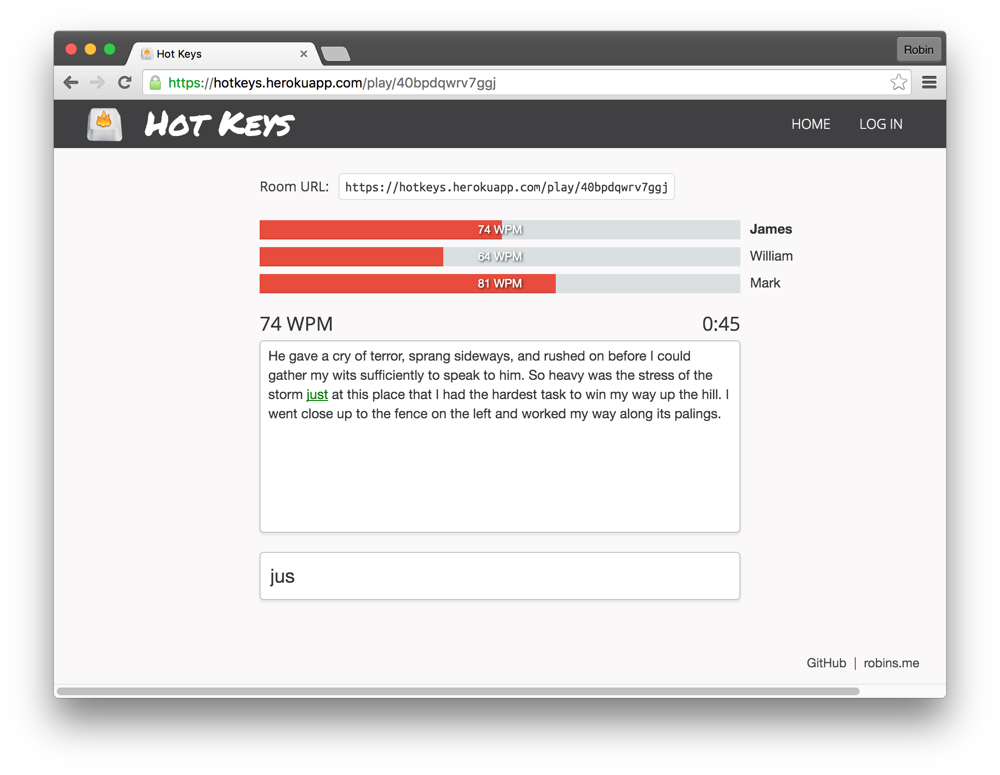

# Hot Keys

Multiplayer typing game modelled on [Typeracer](http://play.typeracer.com/). Built with the MEAN stack and Socket.IO.

[https://hotkeys.herokuapp.com/](https://hotkeys.herokuapp.com/)

</img>

## Technology

Node.js, Express.js, MongoDB, AngularJS, Mongoose, Socket.IO, Passport, Bootstrap

**Libraries:** [Chart.js](http://www.chartjs.org/), [Moment.js](http://momentjs.com/)